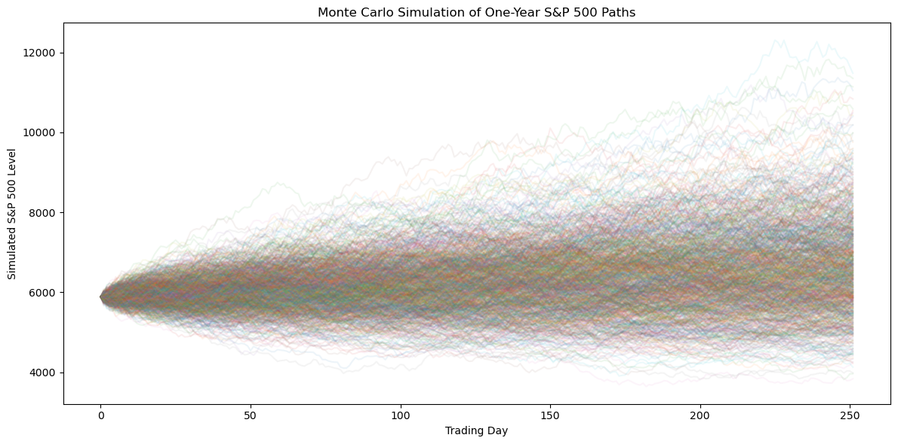
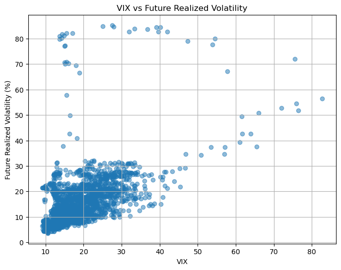

README
# Modeling Market Uncertainty Using Macroeconomic Indicators

> A quantitative finance project analyzing the relationship between financial market volatility and macroeconomic conditions using Python, econometrics, and Monte Carlo simulation.

---

## Overview

This project explores how macroeconomic conditions relate to financial market uncertainty.

Using historical U.S. data from 2015–2024, I combine market data from the S&P 500 and the VIX with macroeconomic indicators—including inflation, unemployment, and the Federal Funds Rate—to investigate how economic conditions are associated with market volatility.

The project applies statistical analysis, financial risk measurement, econometric modeling, and simulation techniques commonly used in quantitative finance.

---

## Motivation

As an Economics student with an interest in quantitative finance, I wanted to build a project that combined financial markets, econometrics, and Python programming.

Rather than analyzing a single stock, I focused on market-wide uncertainty by examining whether macroeconomic variables and implied volatility (VIX) help explain or predict realized market volatility.

This project also served as an opportunity to strengthen my Python skills while applying concepts from economics and finance in a practical setting.

---

## Project Objectives

- Analyze historical S&P 500 performance and market volatility
- Compare implied volatility (VIX) with realized market volatility
- Examine relationships between macroeconomic variables and market volatility
- Calculate common financial risk measures
- Evaluate whether the VIX contains information about future realized volatility

---

## Methods

The notebook includes:

- Data collection using Yahoo Finance and FRED
- Data cleaning and preprocessing
- Exploratory Data Analysis (EDA)
- Correlation analysis
- Multiple Linear Regression (OLS)
- Sharpe Ratio
- Historical Value at Risk (VaR)
- Expected Shortfall (CVaR)
- Monte Carlo Simulation
- Predictive regression using the VIX

---

## Technologies Used

- Python
- Jupyter Notebook
- NumPy
- Pandas
- Matplotlib
- Statsmodels
- yfinance
- pandas-datareader

---

## Data Sources

- Yahoo Finance
  - S&P 500 Index (^GSPC)
  - CBOE Volatility Index (^VIX)

- Federal Reserve Economic Data (FRED)
  - Consumer Price Index (CPI)
  - Unemployment Rate
  - Federal Funds Rate

---

## Key Findings

The analysis suggests several notable relationships:

- Daily S&P 500 returns and the VIX exhibit a negative contemporaneous relationship.
- Among the macroeconomic variables examined, unemployment displayed the strongest association with realized market volatility.
- Historical Value at Risk and Expected Shortfall provide useful measures of downside market risk.
- Monte Carlo simulation illustrates the range of potential future market outcomes under historical assumptions.
- The VIX showed a statistically significant association with future realized volatility, although much of the variation remained unexplained.






---

## Repository Structure

```
modeling-market-uncertainty/
│
├── modeling_market_uncertainty.ipynb
├── README.md
├── requirements.txt
├── .gitignore
└── LICENSE
```

## How to Run

1. Clone this repository.
2. Install the required packages:

```bash
pip install -r requirements.txt
```

3. Open `Modeling_Market_Uncertainty.ipynb` in Jupyter Notebook or VS Code.
4. Run all cells from top to bottom.

The notebook automatically downloads financial market data from Yahoo Finance and macroeconomic data from FRED.

---

## Future Improvements

Possible extensions include:

- GARCH volatility forecasting
- Portfolio optimization
- Factor investing (Fama–French models)
- Black–Scholes option pricing
- Machine learning approaches to volatility prediction
- Out-of-sample forecasting and model validation

---

## Author

Michael

Economics student at Concordia University with interests in:

- Quantitative Finance
- Econometrics
- Financial Markets
- Macroeconomics
- Data Science
- Python

This repository is part of my ongoing quantitative finance portfolio.
